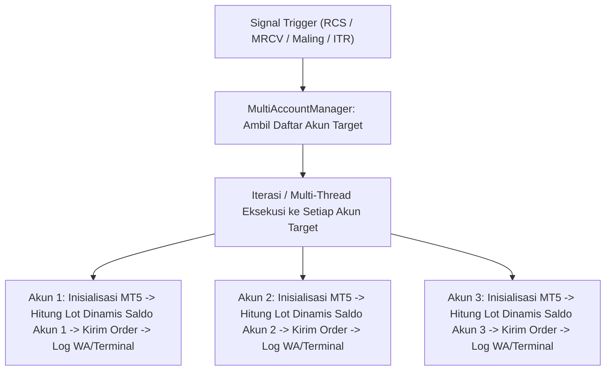

# Implementation Plan - Sistem Multi-Account MT5 (Single Command Execution ke Banyak Akun)

## Ringkasan Kebutuhan Arsitektur

User ingin menjalankan **Multi-Account MT5 (Banyak Akun MT5 Sekaligus)** dengan prinsip **1x Jalankan Perintah Terminal per Bot**:

1. **Konfigurasi Akun Terpusat di `.env`**:
   Mendaftarkan beberapa akun MT5 beserta `path terminal64.exe`, `login`, `password`, dan `server`.
2. **Fleksibilitas Pemetaan Bot per Akun**:
   Setiap jenis bot (`RCS`, `MRCV`, `ITR`, `Tuyul Maling`, `ScannerInfo`) dapat menentukan akun-akun mana saja yang menjadi target eksekusinya.
3. **Single Command Multi-Account Execution**:
   Saat menjalankan perintah (misal `python run_rcs_watchdog.py`), sistem secara paralel mengirimkan eksekusi order ke **seluruh akun MT5 target sekaligus** dengan **kalkulasi Lot Dinamis yang disesuaikan secara mandiri dengan saldo masing-masing akun!**

---

## 🛠️ Desain Konfigurasi di `.env`

```ini
# =====================================================
# MULTI-ACCOUNT MT5 CONFIGURATIONS
# =====================================================
MULTI_ACCOUNT_ENABLED=true

# DAFTAR AKUN TERDAFTAR (Dipisahkan Koma)
ACCOUNTS_LIST=ACC1,ACC2,ACC3

# AKUN 1 (Misal: Headway Demo)
ACC1_NAME=Headway_Demo
ACC1_PATH=C:/Program Files/MetaTrader 5 Headway/terminal64.exe
ACC1_LOGIN=5034723
ACC1_PASSWORD=MyPassword1
ACC1_SERVER=Headway-Demo

# AKUN 2 (Misal: Exness Real)
ACC2_NAME=Exness_Real
ACC2_PATH=C:/Program Files/MetaTrader 5 Exness/terminal64.exe
ACC2_LOGIN=1234567
ACC2_PASSWORD=MyPassword2
ACC2_SERVER=Exness-Real10

# AKUN 3 (Misal: XM Real)
ACC3_NAME=XM_Real
ACC3_PATH=C:/Program Files/MetaTrader 5 XM/terminal64.exe
ACC3_LOGIN=8899112
ACC3_PASSWORD=MyPassword3
ACC3_SERVER=XMGlobal-Real15

# TARGET AKUN PER STRATEGI (Kosongkan jika semua akun)
RCS_TARGET_ACCOUNTS=ACC1,ACC2
MRCV_TARGET_ACCOUNTS=ACC1
MALING_TARGET_ACCOUNTS=ACC1,ACC3
ITR_TARGET_ACCOUNTS=ACC1
SCANNER_TARGET_ACCOUNTS=ACC1
```

---

## 🏗️ Alur Kerja Sistem Multi-Account Manager



---

## Proposed Changes

### [Multi-Account Core Manager]

#### [NEW] [multi_account_manager.py](file:///c:/codingVibes/mt5/engulfing/mt5_client/multi_account_manager.py)
- Buat modul `MultiAccountManager` yang:
  - Membaca daftar akun `ACCOUNTS_LIST` dari `.env`.
  - Mengelola sesi koneksi `mt5.initialize(path, login, password, server)` ke masing-masing terminal.
  - Menyediakan wrapper `execute_multi_account_order()` yang mendistribusikan order ke setiap akun target secara paralel.

---

### [Integration into Order Senders & Engines]

#### [MODIFY] [rcs_order_manager.py](file:///c:/codingVibes/mt5/engulfing/strategies/strategy_rcs/rcs_order_manager.py)
- Update `send_market_order_rcs` dan `send_pending_order_rcs` agar jika `MULTI_ACCOUNT_ENABLED=true`, order dikirimkan ke semua akun yang ada di `RCS_TARGET_ACCOUNTS`.

#### [MODIFY] [mrcv_order_manager.py](file:///c:/codingVibes/mt5/engulfing/strategies/recovery_marubozu/orders/mrcv_order_manager.py)
- Update `send_market_order_rcs` dan `close_all_positions` agar mengeksekusi seluruh akun target MRCV (`MRCV_TARGET_ACCOUNTS`).

#### [MODIFY] [itr_order_manager.py](file:///c:/codingVibes/mt5/engulfing/strategies/infinity_trailing/itr_order_manager.py)
- Update pengiriman order ITR untuk mendukung target akun ITR.

#### [MODIFY] [order_sender.py](file:///c:/codingVibes/mt5/engulfing/mt5_client/execution/order_sender.py)
- Update pengiriman order Tuyul Maling (Engulfing) untuk mendistribusikan order ke `MALING_TARGET_ACCOUNTS`.

---

## What User Needs to Prepare (Apa yang Harus Disiapkan User)

1. **Install installer MT5 di folder berbeda di PC/VPS**:
   - Misal: Terminal 1 di `C:/Program Files/MetaTrader 5/`
   - Terminal 2 di `C:/Program Files/MetaTrader 5 Exness/`
2. **Siapkan informasi Login, Password, dan Server** untuk tiap akun MT5 yang ingin diikutsertakan.

---

## Verification Plan

### Manual Verification
1. Uji `MultiAccountManager` dengan 2 terminal MT5 (Demo Headway + Demo Exness/MetaQuotes).
2. Jalankan `python run_rcs_watchdog.py`.
3. Verifikasi order terkirim ke **keduanya secara bersamaan** dengan ukuran lot yang terhitung sesuai saldo masing-masing akun.
